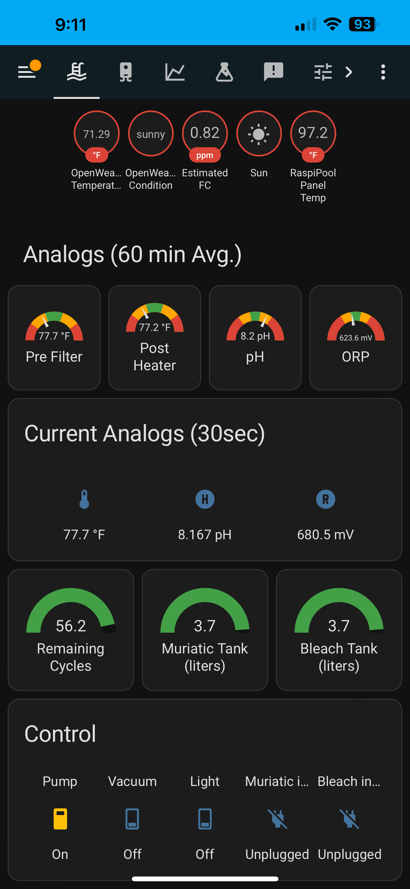
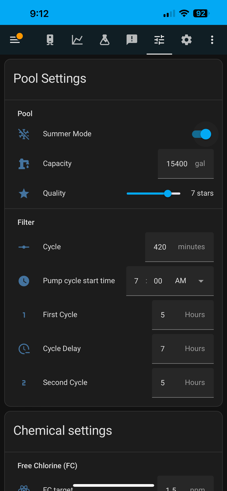
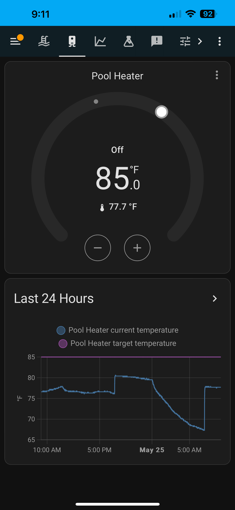

# raspipool
**Swimming-Pool Automation Systen with Raspberry Pi + Home Assistant**

,,

## Overview:

 A cost-effective, easy-to-build, easy-to-use "Swimming-Pool Automation System" with top functions to automate, control and monitor (from web) small-medium size swimming pools.

- Automatic filter control (fixed and dual-speed pumps, 1 or 2 daily cycles) based on time or temperature. (default files are set for fixed speed pump and a set start time)
- 3 sensors:
  - water temperature (one-wire [DS18B20 Waterproof Sensor](https://aliexpress.com/item/32968031204.html))
  - [Ezo ph Circuit](https://www.atlas-scientific.com/embedded-solutions/ezo-ph-circuit)
  - [Ezo orp Circuit](https://www.atlas-scientific.com/embedded-solutions/ezo-orp-circuit)
  - [EZO Carrier Board](https://www.atlas-scientific.com/carrier-boards/electrically-isolated-ezo-carrier-board-gen-2).
    -  A custom UART sensor for HA has been developed in the included code.
- Relay Board with a minimun of [4 relays](https://aliexpress.com/item/32961638909.html) [or 6](https://aliexpress.com/item/32997012084.html)
  This project used the 6 relay rpi hat.
   - controlling :
    -  pump on/off and pump speed (high/low)
    -  muriatic acid injection (to regulate pH) and bleach injection (to mantain sanitization level)
 
 System is intended to monitoring and automatically control most important functions and notify to mobile all possible events.

 
 
 ## Build system:
 
 Follow instructions in wiki [howto build a bypass to connect sensors to the pool](https://github.com/segalion/raspipool/wiki/Bypass-for-sensors), [howto connect sensors to the raspberry pi](https://github.com/segalion/raspipool/wiki/Sensors-connection-(DS18B20,-and-EZO-pH-and-ORP)) and [howto connect relays between pumps and raspberry pi](https://github.com/segalion/raspipool/wiki/Connection-of-relays-for-pump-control)

 Flash Ezo Sensors into UART mode by following the directions in their respective datasheets.
 
 ## Install
 0. Install [hassbian](https://www.home-assistant.io/docs/installation/hassbian/installation/) in a raspberry pi (3 or 4 [not tested on pi 5]), and give wifi connection.
 1. Copy 'custom_components', 'packages' folders (with all paths and contents) and 'ui-lovelace.yaml' frontend file in homeassistant conf_dir ( i.e. /home/homeassistant/.homeassistant/ ).
 2. Modify your 'configuration.yaml' (including '  packages: !include_dir_named packages', disabling automations, scripts and groups, discovery and lovelace in yaml mode) as example in code
 3. Create/modify proper 'secrets.yaml' for apis (latitude/longitude, pushbullet api, openweathermap api, etc).

  ## Default Setup:
 - The current code is setup for the following:
    - 1 circulation pump and 1 vacuum booster pump
    - natural gas pool heater
    - pool light
    - 3 ds18b20 temperature sensors (pre-filter, post-heater and a control panel temperature)
    - 2 100ml/m parastalic pumps
    - 1 Atlas Ezo ORP sensor with
 
 ## TODO:
 - Build a more simple yet powerful controller using ESP32/ESPHome
 - Utilize i2c bus to use Atlas Sensors to their fullest, i.e. be able to calibrate sensors. Use more sensors including filter pressure sensor.
 - Control Variable Speed Motor
 - 
 
 ## Optional
 For pumps <= 1.5 HP, a external sensor to measure power consumption and [safe motor](https://en.wikipedia.org/wiki/Magnetic_starter) (based on sonoff POW)
 
 Thanks to Hidromaster, Piscidoc, and all DIY enthusiasts from [hablemosdepisicnas](http://www.hablemosdepiscinas.com/foro/viewtopic.php?f=11&t=3906) and [TFP](https://www.troublefreepool.com/threads/raspipool-pool-automation-system-with-raspberry-pi-home-assistant.188410/) forums.
